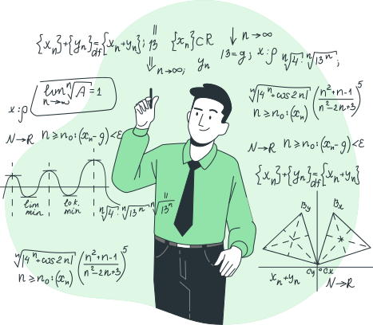

<h1>
A simple scaler-based implementation of Neural Networks from scratch. 
</h1>

Adapted from <a href="https://github.com/karpathy">Andrej Karpathy</a>'s micrograd.  
Micrograd - https://github.com/karpathy/micrograd

